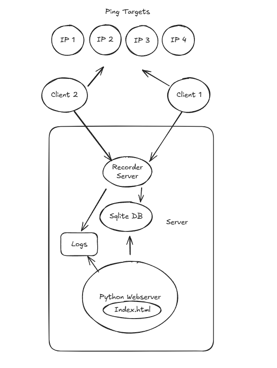

# Ping Tool  
2025-06-02 by Sven

**Ping Tool** is a Python-based tool designed to record ping latency and visualize the data with graphs.  

The program consists of three main components: **recorder**, **Server** and **Client**, with the following features and key points:  

---

# 1. Diagram
```mermaid
┌──────────────┐
│   Client(s)  │
│ (Linux/Win)  │
└─────┬────────┘
      │
      │ 1. Pings multiple IPs
      │
      ▼
┌──────────────┐
│  Recorder    │
│ (Linux)      │
└─────┬────────┘
      │
      │ 2. Receives ping data and stores it in
      │    the SQLite database
      │
      ▼
┌──────────────┐
│   Database   │
│  (SQLite3)   │
└─────┬────────┘
      │
      │ 3. Server reads data from the database
      │
      ▼
┌──────────────┐
│   Server     │
│ (Web App)    │
└──────────────┘
      │
      │ 4. Displays ping latency graph on the web
      ▼
```


## 2. Server  

The **Server** is primarily responsible for collecting data sent by clients, storing it in a database, and displaying the data on a web interface.  

### 2.1. Data Collector Service  
- Runs as a background service using `systemctl`.  
- Receives latency data sent from clients.  
- Stores the data in a SQLite database.
- Module name: `ping_tool_recorder`.  
- API: name,timestamp,host,ping_ip,status,delay_in_ms  
  Description:  
  - name: The name of the client (It's unique for each client)
  - timestamp: The timestamp of the data.
  - host: The hostname of the client.
  - ping_ip: The IP address being pinged.
  - status: The status of the ping request.1: success, 0: failed
  - delay_in_ms: The latency in milliseconds. if failed, delay_in_ms = 0

### 2.2. Web Application  
- Provides a graphical interface to visualize the ping latency data.  
- Web framework: Flask
- Charting library: Chart.js
- Read data from sqlite database.
- Add data filtering options.
- Module name: `ping_tool_web`.  

⚠️ These two server-side programs run independently.  

---

## 3. Client  

The **Client** is responsible for:  
- Sending ping requests to target IPs.  
- Recording the latency data.  
- Transmitting the data to the `ping_tool_recorder` module on the server side.  

A single machine (e.g., a Linux computer) can ping multiple IP addresses simultaneously and send the results to the server.  

- Module name: `ping_tool_client`.  

# 4. Technical Stack
## 4.1. ping_tool_recorder

1. Python 3.10 and above  
2. Managed as a background service using `systemctl`  

---

## 4.2. ping_tool_web

1. Python 3.10 and above  
2. SQLite3  
3. Web framework: Flask  
4. Charting library: Chart.js  
5. Managed as a background service using `systemctl`  
6. The page refreshes once per second or uses WebSocket  

---

## 4.3. ping_tool_client

1. Python or Bash  
2. Configurable ping interval (default: 1 second)  

---

# 5. Additional Notes

1. Developed on Ubuntu 24.04  
2. Code and project must include sufficient comments and documentation  

GIT_SSH_COMMAND='ssh -i ~/.ssh/id_ed25519 -o IdentitiesOnly=yes -p 12215' git pull git@192.168.1.71:/sg_it/ping_tool

TO be used with sudo